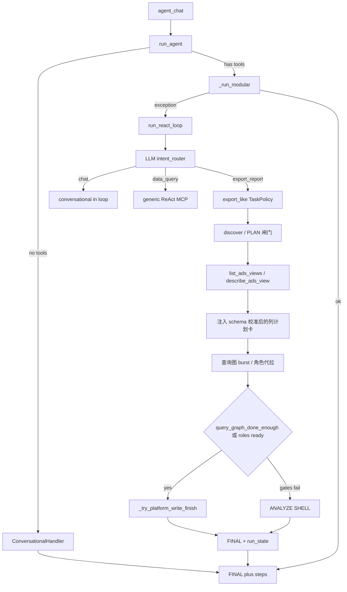

# react_engine 设计说明

面向开发者的引擎内部地图。Agent 侧操作手册见 Skill SOP：

[`apps/api/data/skills/e05b2cf5/ads-sync-hub/references/export-report.md`](../apps/api/data/skills/e05b2cf5/ads-sync-hub/references/export-report.md)

本文描述**平台如何编排**（loop / 阶段 / 双路径 / 预算）；SOP 描述**模型应如何写 PLAN / MCP / FINAL**。两者分工，勿混为一谈。

契约边界（TaskSpec / ExportContract / QueryExecutor / Materializer / Finalizer / EngineOutcome）见：

[`docs/model-engine-contract.md`](model-engine-contract.md)

---

## 1. 定位与模块地图

### 1.0 三层入口（现状）

生产聊天走 [`agent_chat`](../apps/api/app/routers/agent_chat.py) → [`run_agent`](../apps/api/app/services/agent_runtime/runtime.py)，**不是**直接调 `run_react_loop`。

| 层 | 入口 | 职责 |
|----|------|------|
| 对外入口 | [`run_agent`](../apps/api/app/services/agent_runtime/runtime.py) / `AgentRuntime.run` | 解析 LLM/沙箱/MCP/Skill，构造 `AgentContext` |
| 模块化环 | `AgentRuntime._run_modular` + `agent_runtime/*` | DecisionEngine / ToolExecutor / PhaseManager / `export/orchestrator` 等；无工具时走 `ConversationalHandler` |
| Monolith 兜底 / 导出重路径 | [`run_react_loop`](../apps/api/app/services/react_engine.py)（~**17k** 行） | 完整 ADS 导出状态机、查询图 burst、platform write、FINAL/run_state；modular 失败时 fallback |

```text
agent_chat → run_agent
  → ConversationalHandler（无 MCP / Skill / RAG）
  → AgentRuntime._run_modular（通用工具环 + 导出编排雏形）
  → 异常则 fallback → run_react_loop（导出齐套 / 代拉 / 物化仍以 monolith 为准）
```

### 1.1 模块表

| 模块 | 职责 |
|------|------|
| [`agent_runtime/`](../apps/api/app/services/agent_runtime/) | Facade（`run_agent`）、conversational、decision、tool_executor/router、phase_manager、export orchestrator、hub；`utils.py` 与 monolith helpers 有重叠 |
| `react_engine.py` | Monolith ReAct + ADS 导出状态机；helpers + 嵌套在 loop 内的拉数/写表/MCP I/O 闭包 |
| [`intent_router.py`](../apps/api/app/services/intent_router.py) | 回合 LLM 结构化意图：`chat` / `data_query` / `export_report` / `other_tools` |
| [`mcp_resource_bind.py`](../apps/api/app/services/mcp_resource_bind.py) | `data_query`：MetricIntent → MCP 白名单（禁止默认全量拉取） |
| [`metric_registry.py`](../apps/api/app/services/metric_registry.py) | **seed 口径库**：MetricSpec；运行时以 MCP schema 为准 |
| [`export_column_plan.py`](../apps/api/app/services/export_column_plan.py) | 表头 → registry seed → 查询图；schema-aware 校准；计划卡文案 |
| [`task_policy.py`](../apps/api/app/services/task_policy.py) | `export_like`；分型 `light_identity` / `multi_fact` / `single_view`；generic PLAN 闸门 |
| [`workplace.py`](../apps/api/app/services/workplace.py) | Workplace FS：`task/<run_id>/page_*.json`、UID 收集、join 物化 helpers |
| [`skill_lesson.py`](../apps/api/app/services/skill_lesson.py) | lesson 回写 skill；与 run-state 配合做缺口提示 |
| [`export_build_report.py`](../apps/api/app/services/export_build_report.py) | 分析表 +「口径说明」双 sheet 包装 |

已抽取的契约/执行模块（职责细节以 [model-engine-contract.md](model-engine-contract.md) 为准，此处只列入口）：

| 模块 | 一句话 |
|------|--------|
| [`export_task_spec.py`](../apps/api/app/services/export_task_spec.py) | TaskSpec |
| [`export_task_validator.py`](../apps/api/app/services/export_task_validator.py) | TaskSpecValidation |
| [`export_contract.py`](../apps/api/app/services/export_contract.py) | `build_export_contract` |
| [`export_contract_updater.py`](../apps/api/app/services/export_contract_updater.py) | schema 证据写回；同步 column_plan / query_graph / contract |
| [`export_schema_discovery.py`](../apps/api/app/services/export_schema_discovery.py) | describe 解析；metadata action 规划 |
| [`export_schema_executor.py`](../apps/api/app/services/export_schema_executor.py) | 执行 schema discovery MCP |
| [`export_query_executor.py`](../apps/api/app/services/export_query_executor.py) | 节点 skip / fail / done 决策（MCP I/O 仍在 loop） |
| [`export_trace.py`](../apps/api/app/services/export_trace.py) | ExportTrace → `task/<run>/export_trace.json` |
| [`export_run_state.py`](../apps/api/app/services/export_run_state.py) | `_run_state.json` 结构化状态 |
| [`export_repair_plan.py`](../apps/api/app/services/export_repair_plan.py) | RepairPlan |
| [`export_materializer.py`](../apps/api/app/services/export_materializer.py) | `materialize_platform_export`（平台写表） |
| [`export_verifier.py`](../apps/api/app/services/export_verifier.py) | 写表后 / FINAL 前校验 |
| [`export_finalizer.py`](../apps/api/app/services/export_finalizer.py) | verifier + repair + EngineOutcome 闭环 |
| [`export_engine_outcome.py`](../apps/api/app/services/export_engine_outcome.py) | EngineOutcome 字段 |

结构特点：**导出齐套 / 代拉 / 物化闭环仍以 monolith + 上表 `export_*` 为准**；modular 负责入口与通用工具环雏形。MCP 调用与分页落盘仍多在 `run_react_loop` 嵌套函数中（如 `_engine_fetch_planned_roles`、`_try_platform_write_finish`）。

### 1.2 意图路由（monolith / 导出重路径内）

进入 `run_react_loop` 后，**回合意图**由 [`intent_router.py`](../apps/api/app/services/intent_router.py) 的 LLM 结构化结果决定（`chat` / `data_query` / `export_report` / `other_tools`），不再用「绑定导出 Skill + 新增注册」正则把单指标查数吸进导出状态机。

- `chat` → conversational（无 MCP）
- `data_query` / `other_tools` → 通用 ReAct；查数按需：LLM `MetricIntent` → 缺口门闩（缺时间窗/指标先追问）→ [`mcp_resource_bind`](../apps/api/app/services/mcp_resource_bind.py) 白名单 query（禁止默认全量拉取；`metric_registry` 仅 soft seed）
- `export_report` → 导出状态机；意图 JSON 产出日历级 `time_window`（`start_date`/`end_date`/`tz`），由引擎确定性换算毫秒窗后注入
- TaskSpec / `needs_export_clarify` 的 **clarification 不再硬 return**（只记步骤 + system 提示后继续工具环）

导出路径在 `export_like` 后挂上阶段、预算、引擎代拉等策略。

### 1.2.1 模型理解层（运行时）

目标：模型负责理解需求，引擎负责契约化执行和验证。

当前运行时把“模型理解”拆成三类输入，而不是让模型直接写死执行套路：

| 场景 | 代码入口 | 产物 |
|------|----------|------|
| 寒暄 / 身份 / 能力说明 | [`ConversationalHandler`](../apps/api/app/services/agent_runtime/conversational.py) + [`SystemPromptBuilder.build_conversational_system`](../apps/api/app/services/agent_runtime/system_prompt.py) | 自然语言回复；禁止 `PLAN:` / `FINAL:` / 工具协议外露 |
| 回合意图分类 | [`intent_router.py`](../apps/api/app/services/intent_router.py) | `TurnIntent(intent, metrics, time_window, wants_deliverable)` |
| 导出契约 seed | `TaskPolicy` + `build_export_contract` | `TaskSpec` / `ColumnPlan` / `QueryGraph` 初版，后续由 schema discovery 校准 |

模型理解层应做：

- 保留 Agent 身份：回复体现 `agent.name` / `agent.description`，但不复述基础提示词原文。
- 先判意图：`chat`、单指标 `data_query`、多列 `export_report`、文件/脚本类 `other_tools` 分开。
- 导出只抽取契约输入：任务类型、时间窗、人群口径、输出列、筛选、歧义和验收标准。
- 对信息不足的任务提出澄清；对可执行任务交给引擎做 schema、SQL、分页、物化和验证。

模型理解层不应做：

- 把所有对话默认套进导出状态机。
- 因绑定导出 Skill 就把单指标查数升级成报表导出。
- 在回复中展示 `FINAL:` 这类内部协议前缀。
- 用散文 PLAN 替代 `TaskSpec` / `ColumnPlan` / `VerifierResult`。

monolith 兜底也保留同样约束：`react_engine.py` 有轻量交互 fast path、模型理解 system 提示、
以及最终展示清理，确保 fallback 时不会把内部协议直接露给用户。

### 1.3 模块化 vs Monolith 能力矩阵

| 能力 | 主要归属 | 说明 |
|------|----------|------|
| 无工具闲聊 / conversational 步骤 | `agent_runtime`（`ConversationalHandler`） | 无 MCP/Skill/RAG 时 fast path |
| 通用 MCP ReAct、参数软对齐 | 两边；完整实现源在 monolith | modular 有 ToolExecutor；导出复杂场景常 fallback |
| export 阶段机、query_graph burst、core ladder、platform write、EngineOutcome | **`react_engine` + `export_*.py`** | modular 有 PhaseManager / orchestrator 雏形，齐套仍以 monolith 为准 |
| FINAL / `meta.steps` / `step_count` 可见性 | 落盘侧 | monolith finalize 用 `_ensure_visible_run_steps` 保证 ≥1 可视步；modular 步骤契约仍在演进 |
| hub / `stop_chat` / `is_running` | `agent_runtime.hub`（monolith 再导出） | WS 步骤与 running 标志 |

历史文档（如 `v1.9.0-baseline-diff.md`）若仍写「ReAct 待 W4」，以 [feature-parity.md](feature-parity.md)「W4 Done」与本文为准。

---

## 2. 任务分型命名对照

Skill 口语 **A / B / C** 与代码枚举不完全同名：

| Skill 口语 | 代码（`task_policy` / `export_view_mode`） | 典型行为 |
|------------|-------------------------------------------|----------|
| Type A | `light_identity` | 轻量身份列表；角色以 `user` 为主 |
| Type B | `multi_fact` + 多指标列计划 + MCP schema 发现 | schema-first；`export_full_fetch`；短页齐套；优先平台写表 |
| Type C | `single_view` | 点名 `view_result_*`；不默认拉齐多角色 |

**不变量：**口语里的「Type-B」≈「多指标列计划 + MCP schema 发现」，**不等于**单独看到 `multi_fact` 字符串。列计划只作为 seed；不得跳过 `list_ads_views / describe_ads_view` 直接按静态套路拉数。

代码判定：`_is_type_b_export(view_mode, column_plan)` — 有列计划且非 `single_view` 时打开 Type-B 预算与 `export_full_fetch`。这与「永不靠静态列计划跳过 discover」的 `_type_b_prefilled_plan_ready`（恒 `False`）是两个函数。

---

## 3. 阶段机

导出阶段标签：`discover → plan → fetch → analyze → finalize`。

- 普通多事实：先 discover / PLAN 闸门，再 fetch。
- Type-B 列计划就绪：仍必须先完成 MCP schema 发现；`_type_b_prefilled_plan_ready` 恒为 `False`，不再跳过 discover。
- 结构化 `TaskSpec/ColumnPlan` 校验通过时，`_should_auto_accept_export_plan` 可自动接受结构化 PLAN
  并进入 fetch；不再把模型散文 `PLAN:` 当作唯一入口。schema discovery 作为进 fetch 后的首步执行，不永久卡在 PLAN。



每轮 LLM 前，引擎常先尝试补缺拉数（「轮次前补缺」），避免空转工具预算。

---

## 4. 列计划与查询图

### 4.1 列计划

Type-B 导出必须先走 MCP schema 发现：

```text
list_ads_views -> describe_ads_view(view_name) -> PLAN -> query_ads_view
```

首轮多指标导出在进入 fetch 后，若 `schema_discovery.required=true` 且尚无
`list_ads_views` / `describe_ads_view` 证据，引擎会在 query graph burst 前自动补齐
metadata 调用；metadata 调用不计入 data query 预算。
同时在 `discover` 阶段，引擎会根据当前 `schema_discovery + query_graph`
自动执行 metadata preflight；完成后再进入 PLAN，避免首轮停在“有修复计划但未执行”。

[`build_column_plan`](../apps/api/app/services/export_column_plan.py) 只把编号表头映射到 seed/fallback 规则字典：

- `sources` / `role` / `view`
- `fetch_mode`：`agg` | `field` | `flag` | `top_n` | `sequence` | `lookup` | `derived`
- `agg_spec`：给引擎直接拼 MCP SQL（`select` / `group_by` / `filter_sql` / `time_field`）

视图来自**列用到的 sources**，不是固定清单。默认视图映射见 `metric_registry.VIEW_MAP`。

真实视图名、字段名、备注和可用权限以 MCP `list_ads_views` / `describe_ads_view` 返回为准；静态 registry 不能覆盖运行时 schema。

describe 返回后会进入 schema-aware 调整：

- registry 模板字段不存在时，用字段名/备注匹配真实字段并改写 `agg_spec.select`。
- 时间字段不存在时，选择 describe 中存在的合适时间列。
- filter 引用不存在字段时移除，并在 `schema_adjustments` 留痕。
- registry 未识别列如果能从字段/备注明确匹配，则生成 schema-derived `field` / `agg` 节点。
- 多个 view 有同名/相似字段时，会结合 view 名、表备注和 role 语义打分，避免固定选择第一个命中的表。
- `list_ads_views` / `describe_ads_view` 成功结果会写入 `export_trace.schema_discovery`；
  describe 后同步刷新 trace 中的 `column_plan` 和 `query_graph`。

### 4.2 查询图

[`build_query_graph`](../apps/api/app/services/export_column_plan.py) 从列计划去重出 MCP 节点，**light（agg/field/dim）在前，heavy（top_n/sequence）在后**。

**跳过 / oneshot**（[`query_node_should_skip`](../apps/api/app/services/export_query_executor.py)）以 `node_key` 为准：同一个 view 上的不同 `agg/flag/top_n/sequence`
SQL 不能因为该 view 已有一页就跳过；只有 `field/lookup` 这类整页属性节点可按 view 页去重。

[`sql_from_agg_spec`](../apps/api/app/services/export_column_plan.py) + `_time_predicate`：

- 毫秒时间列（`create_time` / `finish_time` / `update_time` / `register_time` 等）：`field >= start_ms AND field < end_ms`
- Date 列（`stat_date` 或以 `_date` 结尾）：`toDate(fromUnixTimestamp64Milli(ms))`
- 下注 raw / top_n：金额列用 **`bet_sc`**（非 `amount`）

### 4.3 完成判定

| 函数 | 含义 |
|------|------|
| `query_node_should_skip` | 执行前跳过：`done_node_keys` / `node:<key>` 失败 / field·lookup 的 view 页 |
| `query_graph_complete` | **严格**：图上每个节点的 **view** 均已至少 1 页（按 view 页，非 node_key） |
| `query_graph_done_enough` | **可交付**：每个节点已落地或已失败处理；**核心 user/pay 必须有成功页**；bet/heavy 失败可算 handled |

「可写表」看 `done_enough`，不是等所有下注重节点都成功，也不是等 `query_graph_complete`。

---

## 5. 引擎拉数 vs LLM 工具（双路径）

| 关注点 | 引擎驱动 | LLM 驱动 |
|--------|----------|----------|
| 拉数 | `_engine_fetch_planned_roles` → `_engine_pull_query_node` / `_engine_pull_one_role` | 模型输出 `MCP:`（coach + soft-block） |
| 落盘 | `_try_platform_write_finish` → `materialize_platform_export` + finalizer | `SHELL:` 写 xlsx / 跑 `build_report.py` |
| Type-B 主路径 | 查询图 burst → **平台写表 + FINAL** | 门控失败或 grace 耗尽时的兜底 |

### 5.1 查询图 burst

优先 `build_query_graph` + 逐节点 MCP；结果经 `write_task_json_page` 写入 `task/<run_id>/`。节点失败时：

- **top_n / sequence（soft-fail）**：只黑名单 `node:<key>`，不永久毒死共享 fact view
- **bet agg 且 field≠raw**：最多 **1 次** raw 兜底（如 everyday_bygame → `user_bet_log`）
- 仍失败：放弃该段，progress 标明非核心可继续写表并标「未完整」

### 5.2 Pay cohort

充值人群：时间窗在 **pay.`create_time`**（`COHORT_TIME_FIELD`）。

与「总充值金额 / 充值次数 / 充值银行卡」刻意不同：cohort 用 `create_time` 建「窗内下过单」的 uid；金额与次数查询图 agg 用 **`status=2` + `finish_time`**（`PAY_METRIC_TIME_FIELD`）。二者写在 TaskSpec 的 `cohort_time_field` / `metric_time_field_pay`，禁止混写。

退款标记：`status=4` + **`update_time`** 窗。

1. 先拉 pay（可 OFFSET 至短页）
2. `collect_export_uids_from_task` 收集 uid
3. 先拉 cash/bet/card/refund 等事实聚合首页，避免 user_info 批次耗尽预算
4. `user_info` 用 **`uid IN (...)` 批次**（`_EXPORT_USER_UID_BATCH=500`），**不加** `register_time` 窗（避免漏掉「窗内付费、窗外注册」）
5. 探活 / 窄列 / 半批失败时文案带截断 MCP 错误（`_uid_batch_fail_message`）

物化层也遵守同一规则：`time_window.cohort == "pay"` 时不再按 `register_time`
过滤 user_info 行；pay 窗只用于 pay cohort 和指标事实查询。

16 列充值用户任务的关键派生：

- 充值/提现银行卡数量读取查询图聚合结果 `card_cnt`，分别落到第 15/16 列。
- 连续充值次数需要 pay 成功事件 + bet/game 行为事件；查询图会为 sequence 额外生成
  bet 事件节点，物化时计算两次游戏行为之间的最大成功充值次数。
- Top 游戏读取 top_n 聚合结果 `amt`，再 join game 维表输出 `游戏名称,游戏ID`。

### 5.2.1 TaskSpec / Trace / Verifier

| 组件 | 职责 |
|------|------|
| TaskSpec | 结构化任务：A/B/C、cohort、TW、列、验收标准（非散文 PLAN） |
| QueryGraph | 仍由 `build_query_graph` 生成；schema 校准后写入 `export_trace.query_graph` |
| SchemaDiscovery | 多指标导出记录 `required/list_ads_views/described_views`，证明列计划不是固定套路 |
| ExportTrace | 每次 MCP 节点 `record_query`（含 `error_class`）；落盘 `task/<run_id>/export_trace.json` |
| Verifier / Finalizer | 平台写表后校验；**不通过则禁止「已完成」FINAL**；概况用 `build_final_summary_from_verifier`；决策读 `EngineOutcome` |

续跑：repair 意图可读最近 `export_trace`，合并 `done_node_keys` / `failed_views`，避免无脑重拉。
若 trace 尚未包含 `repair_plan`，引擎会以 `_run_state.json` 的 `repair_plan` 兜底；
这保证 schema discovery 缺口从 run_state 生成后，下一轮能进入真实执行链路。
若 RepairPlan 包含 `discover_ads_views` / `describe_ads_views`，提示会带目标 view，
引擎在查询图 burst 前会优先自动执行这些 schema discovery 动作，成功后刷新
`column_plan` / `query_graph` 再继续 query。

### 5.3 OFFSET 与短页

满页（约 `limit × 0.9`）则同窗 OFFSET 续翻；短页视为该 view 拉完。full_fetch 下核心角色继续直到短页或页帽耗尽。

### 5.4 Core ladder（user/pay）

full_fetch 下核心角色最多 `_EXPORT_CORE_ROLE_MAX_FAILURES`（3）次失败阶梯：探活 → 简化 SQL → 原 SQL；仍失败则硬中止该核心（`_full_fetch_core_abort_message`），不伪造 uid。

---

## 6. full_fetch 与预算

`_is_type_b_export` 为真时打开 `export_full_fetch`：

- 预算抬升：`_compute_full_fetch_budget` / `_compute_adaptive_export_budget`
  - 默认 `_EXPORT_QUERY_BUDGET_DEFAULT=14`
  - Type-B 基线 `_EXPORT_QUERY_BUDGET_TYPE_B=18`，自适应上限 `_EXPORT_QUERY_BUDGET_TYPE_B_MAX=22`
  - pay cohort 上限 `_EXPORT_QUERY_BUDGET_TYPE_B_PAY_MAX=30`
  - full_fetch 天花板 `_EXPORT_QUERY_BUDGET_FULL_FETCH_MAX=45`
- **短页门**：`_full_fetch_short_pages_ready` — 强制写表前希望核心已见短页
- **强制写许可**：`_full_fetch_allow_force_write` — 短页就绪，或页帽耗尽 / 核心不可用后的诚实退出

| 角色/节点 | 失败策略 |
|-----------|----------|
| user / pay（核心） | 有界重试 + ladder；不可用则硬停全齐导出 |
| cash / bet（非核心） | 快停 / 放弃；可标未完整后仍写表 |
| top_n / sequence | soft-fail，oneshot per node key |
| channel / game | 页帽小；可降级空维进分析 |

**注意：**「fail-fast」指非核心节点快速放弃，**不是** full_fetch 的反义词。full_fetch 是 Type-B 的齐套制度；fail-fast 是图上失败节点的处理策略。

其它门控（节选）：

- 用户未短页完成前，阻挡 sequence/top_n 吃预算（`_should_block_heavy_while_user_incomplete`）
- pay 齐后、user 未齐时 cash/bet 加深受限；pay-cohort 下 pay 可先于 user

---

## 7. 落盘、FINAL、run-state

### 7.1 物化路径

**Type-B 可交付时优先平台写表**（减少空转 SHELL）：

1. `_try_platform_write_finish` → `materialize_platform_export`（`export_materializer`）
2. `verify_export_finalizer` → `EngineOutcome`；未通过则禁止宣称「已完成」
3. 通过后 `_try_export_hard_finish` 收尾 FINAL

**通用 hard-finish 梯子**（`_try_export_hard_finish`，门控失败或 grace 耗尽时）：

1. 已有合法根目录 xlsx（LLM `SHELL:` 写出）
2. 引擎代执行已有 `build_report.py`（`/tmp/build_report.py` 或 workplace `tmp/build_report.py`）
3. `write_export_deliverable` / `materialize_analyzed_export`（按 uid join + 口径 sheet）
4. `materialize_export_deliverable`（原始 JSON 合并，「原始回退」）

### 7.2 FINAL

`_format_export_final`：概况数字须可从落盘复算；无落盘时 sanitize 禁止编造概况。双 sheet 约定：**数据** + **口径说明**。

### 7.3 Run state / lesson

`_write_export_run_state`（经 `export_run_state` 组 payload）持久化页图、失败视图、预算、deliverable 等；跨 run 可用于 adaptive budget / repair。`skill_lesson` 可把缺口回写到 skill 侧 lesson，供后续改进。

Schema discovery 状态会写入 `_run_state.json` 顶层 `schema_discovery`，并在缺
`list_ads_views` / `describe_ads_view` 时生成对应 `next_actions`。续跑提示最多展示前两个
`next_actions`，用于覆盖 `list_ads_views` + 首个 `describe_ads_view` 的 metadata 补齐路径。
若 run_state 没有已有 `repair_plan`，schema 缺口会自动生成 `discover_ads_views` /
`describe_ads_views` 修复动作；adaptive budget 记忆提示也会保留前两个 schema MCP 建议。

Workplace 布局要点：

```text
workplace/
  task/<run_id>/page_N.json (+ .meta.json)
  task/<run_id>/_run_state.json
  task/<run_id>/export_trace.json
  *.xlsx                    # 最终交付（根目录）
  tmp/build_report.py       # 可选 SHELL 脚本（引擎也认 /tmp/build_report.py）
```

---

## 8. MCP 契约与 coach

| 规则 | 说明 |
|------|------|
| 主工具 | `query_ads_view`，SQL 须 `FROM ads.<view>` |
| 禁止 | SQL 末尾自带 `FORMAT …`（MCP 会再追加） |
| soft-block | fetch 阶段过度 `query_ads_metric` / 无意义 READ 等（`_should_soft_block_*`） |
| 校验/补全 | `_ensure_ads_sql_from`、去 FORMAT、时间窗覆盖检查 |
| 进度文案 | step/progress 附带 `_clip_mcp_error_text`（约 400 字），便于排 SQL/权限问题 |

LLM 侧由 `_export_next_action_coach`、列计划卡、OFFSET 示例等推动「下一刀」正确动作；引擎代拉成功时可不依赖模型自己拼完整拉取序列。

---

## 9. 术语表

| 术语 | 含义 |
|------|------|
| view_category | 视图名模式匹配分类（user/pay/cash/bet/channel/game），用于引擎路由 |
| segment | 节点分段：`identity` / `fact_agg` / `bet_daily` / `top_n` / `sequence` / `dim` 等 |
| full_fetch | Type-B 齐套制度：短页 + 核心重试 + 抬升预算（由 `_is_type_b_export` 打开） |
| done_node_keys | sequence/top_n 成功或放弃后的 oneshot 标记 |
| failed_views | 失败黑名单；含整 view 或 `node:<key>` |
| export_abandoned_roles | 已放弃角色，不再代拉 |
| pay cohort | 人群由 pay 时间窗定义；user 按 uid 批补齐 |
| 短页 | 本页行数低于满页阈值 → 该 view 翻完 |
| 原始回退 | 未做出分析表时的 JSON 直出交付 |
| 未完整 | 非核心失败后口径/列上的诚实标记 |

---

## 10. 关键入口索引

| 符号 | 作用 |
|------|------|
| `run_agent` / `AgentRuntime.run` | **对外编排入口**（`agent_runtime`） |
| `ConversationalHandler` | 无工具闲聊路径 |
| `AgentRuntime._run_modular` | 模块化 ReAct；失败则 fallback monolith |
| `ExportOrchestrator` | modular 侧导出阶段协调（雏形；齐套仍看 monolith） |
| `run_react_loop` | Monolith / 导出重路径与 fallback |
| `_ensure_visible_run_steps` | finalize 时保证 ≥1 可视执行步骤 |
| `_is_type_b_export` | 列驱动 Type-B：打开 `export_full_fetch` / Type-B 预算 |
| `_type_b_prefilled_plan_ready` | 恒 `False`：禁止靠静态列计划跳过 discover |
| `_should_auto_accept_export_plan` | 结构化契约通过时自动接受 PLAN 并进 fetch |
| `build_column_plan` / `plan_one_column` | 表头 → 规则 |
| `build_query_graph` | 列计划 → MCP 节点序 |
| `sql_from_agg_spec` / `_time_predicate` | 节点 SQL / 时间窗 |
| `query_node_should_skip` | 执行前按 node_key / field·lookup 跳过 |
| `query_graph_complete` | 严格：各节点 view 至少 1 页 |
| `query_graph_done_enough` | 可交付图判定 |
| `_engine_fetch_planned_roles` | 引擎 burst / 角色代拉 |
| `_engine_pull_query_node` | 执行单查询图节点并落盘 |
| `_compute_full_fetch_budget` | Type-B MCP 预算 |
| `_full_fetch_allow_force_write` | 强制写表门控 |
| `_try_platform_write_finish` | 平台写表 + verifier/finalizer + 收尾 |
| `materialize_platform_export` | 平台侧双 sheet 物化入口 |
| `materialize_analyzed_export` | uid join 成中文分析行（hard-finish 回退路径） |
| `write_export_deliverable` | 双 sheet 交付包装 |
| `_format_export_final` | FINAL 文案 |
| `_write_export_run_state` | 运行状态持久化 |
| `_parse_export_time_window` | 自然语言时间窗 → ms |
| `write_task_json_page` | MCP 行写入 task 页 |

---

## 11. Type A / C 差异（短）

- **A (`light_identity`)**：角色与查询图以身份为主；预算与页帽更紧；不必拉齐 cash/bet。有列计划时 `_is_type_b_export` 仍可能为真（非 `single_view`），但仍以身份角色为主。
- **C (`single_view`)**：`export_pinned_views` 约束；引擎不按全量默认代拉；适合「只要这一张视图」；不打开 Type-B full_fetch。

通用非导出任务走 `task_policy` 的 generic PLAN 闸门，不进入上述 ADS 导出状态机细节。

---

## 维护提示

| 要改什么 | 改哪里 |
|----------|--------|
| 入口路由 / 无工具闲聊 / modular 环 | `agent_runtime/`（`runtime.py`、`conversational.py` 等） |
| 列口径（字段名、时间类型） | `export_column_plan.py` 的 `agg_spec` / `_time_predicate` + 单测 |
| 齐套 / full_fetch / 代拉 / 失败策略 | `react_engine.py`（full_fetch / `_fail_node_once` 等），保持「核心硬、非核心软」 |
| 契约字段 / verifier / repair | 对应 `export_*.py` + 同步 [`model-engine-contract.md`](model-engine-contract.md) |
| 业务列口径、导出 SOP 文案 | Skill `references/*.md`（**不要**写进引擎常量 / `task_policy`） |

- Agent 可见步骤与 FINAL 形态变更时，同步核对 Skill `export-report.md`。SOP 仍偏「模型写 PLAN」；平台以引擎代做 schema metadata + 结构化 auto-accept 为准，勿把 SOP 当 SQL 口径源。
- 本文只维护 loop / 入口地图；契约长文不重复展开。
